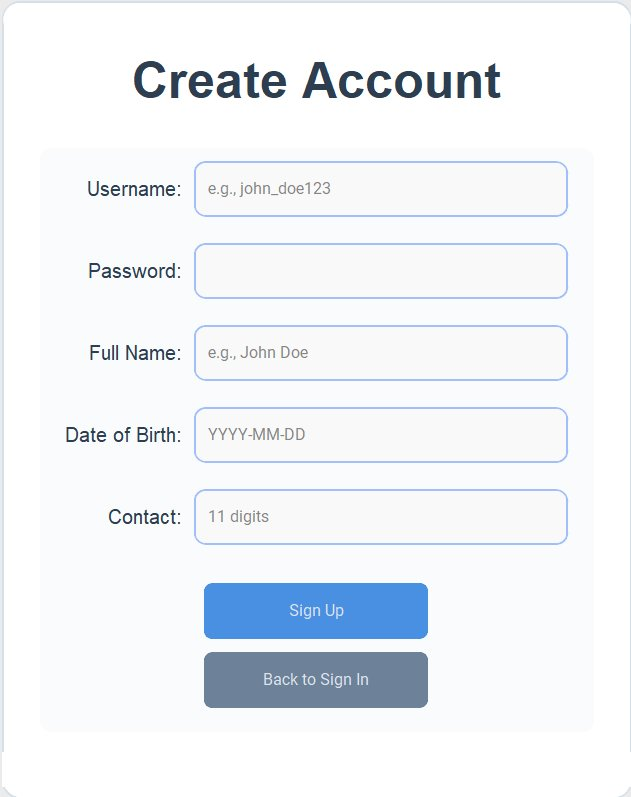
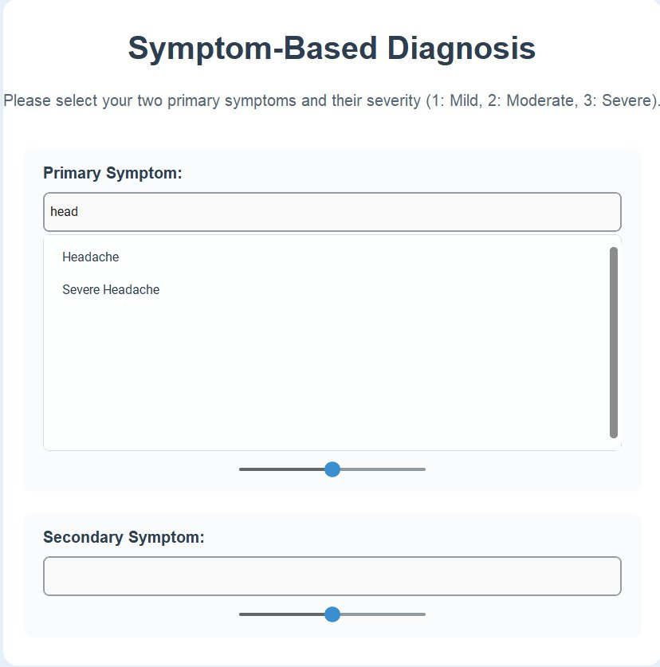
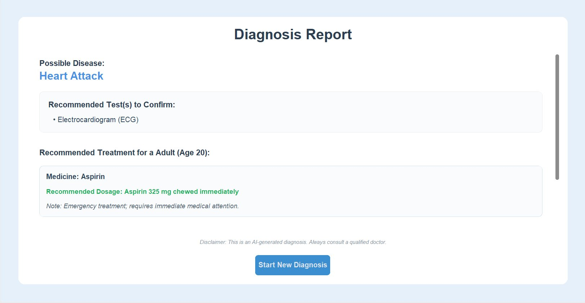
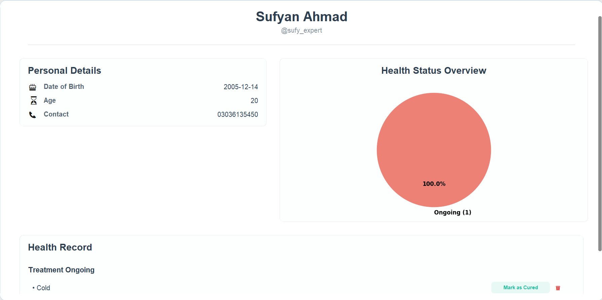

# 🏥 Medical Diagnostic System — Version 1

The original desktop version of the Medical Diagnostic System. A standalone Python GUI application that uses a **Neo4j knowledge graph** and a **Bayesian Network** to diagnose diseases from entered symptoms and recommend treatments — with user profile management and a full multi-screen Tkinter interface.

---

## 📸 Screenshots

### Sign Up


### Diagnosis


### Diagnostic Report


### User Profile


---

## 🛠 Tech Stack

| Component     | Technology                                      |
|---------------|-------------------------------------------------|
| UI Framework  | Python CustomTkinter + tkinter                  |
| Database      | Neo4j (cloud-hosted graph database)             |
| AI / Inference| Bayesian Network (custom probabilistic engine)  |
| Visualisation | Matplotlib (embedded charts via FigureCanvasTkAgg) |
| Image Handling| Pillow (PIL)                                    |
| Language      | Python 3                                        |

---

## 🧠 Core Concepts

### Bayesian Network
The diagnostic engine is a custom **Bayesian Network** that:
- Loads disease–symptom relationships from **Neo4j** (weights + probabilities).
- Accepts a set of user-reported symptoms.
- Computes posterior disease probabilities using conditional probability tables.
- Returns a ranked list of likely diseases.

This is the key differentiator from Version 2, which uses a Random Forest classifier instead.

### Neo4j Knowledge Graph
Same graph schema as V2:
```
(Disease) -[:HAS_SYMPTOM]-> (Symptom)   { weight, probability }
(Disease) -[:TREATED_BY]->  (Medicine)  { dosage info }
(Disease) -[:DIAGNOSED_BY]-> (Test)
```
The connection is **lazy-initialised** — the driver connects only when the first diagnosis is requested, not at app startup.

### Multi-Screen Desktop UI
Built entirely with **CustomTkinter** in a single main window:
- Screen switching is done by destroying and rebuilding the window children (no multi-window popups).
- A persistent layout wrapper (`_create_persistent_layout`) handles the navbar + page container pattern.
- Supports light mode with a blue colour theme.

### User Profiles
- Profiles saved locally as `.txt` files in `src/Profiles/`.
- Profile data includes name, age, and past diagnosis history.

---

## 📁 File Hierarchy

```
medical-diagnostic-system/
│
├── src/
│   ├── diagnostic_system.py     # Main app — all screens, Bayesian Network, Neo4j integration
│   ├── diseases_knowledge.py    # Disease definitions and symptom mappings (Python dict)
│   ├── medicines_knowledge.py   # Medicine data with dosage info
│   ├── tests_knowledge.py       # Lab test recommendations per disease
│   ├── model_evaluation.py      # Evaluation/benchmarking utilities
│   └── Profiles/
│       └── sufy_expert.txt      # Example saved user profile
│
├── data/                        # Raw text knowledge base files
│   ├── knowledge.txt
│   ├── knowledge_medicines.txt
│   └── knowledge_tests.txt
│
├── requirements.txt
└── screenshots/
    ├── screenshot_signup.png
    ├── screenshot_diagnosis.png
    ├── screenshot_report.png
    └── screenshot_profile.png
```

---

## 🔄 Comparison: V1 vs V2

| Feature                  | V1 (This project)        | V2                          |
|--------------------------|--------------------------|-----------------------------|
| Interface                | Desktop (CustomTkinter)  | Web (React + Flask)         |
| Inference Engine         | Bayesian Network         | Random Forest + Bayes blend |
| Database (Users)         | Local .txt files         | MongoDB Atlas               |
| Knowledge DB             | Neo4j (cloud)            | Neo4j (cloud)               |
| Authentication           | Simple local             | bcrypt hashing              |
| Diagnosis History        | Local profiles           | MongoDB stored              |

---

## ⚙️ Setup & Run

```bash
pip install -r requirements.txt
# Ensure Neo4j credentials are configured inside diagnostic_system.py
python src/diagnostic_system.py
```

### Requirements
```
customtkinter
neo4j
Pillow
matplotlib
```

> **Note:** The Neo4j connection URI and credentials are currently hardcoded in `diagnostic_system.py`. Update them before running.
